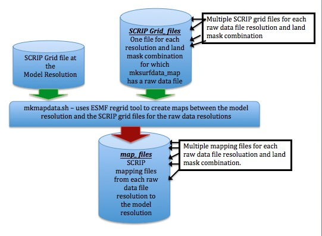

.. _clm_grid:

4. Creating New Domain and Land Surface Data Files for CLM
===========================================================

The input files for CLM are surface-datasets that describe the surface characteristics needed by CLM (fraction of grid cell covered by different land-unit types, and fraction for different vegetation types, as well as things like soil color, and soil texture, etc.). The ``mksurfdata_map`` tool, available through CLM, is used to create these surface-dataset files from grid datasets and raw datafiles at half-degree resolution.

``mksurfdata_map`` requires a mapping file, for each of the raw datasets, to map from the output (model) grid resolution to the grid and land-mask for of the raw dataset. This is done by another tool, ``mkmapdata.sh``. To create the mapping files you need a SCRIP grid file to correspond with each resolution and land mask that you have a raw data file in mksurfdata_map. Some raw datasets share the same grid and land mask -- hence they can share the same SCRIP grid file. The output maps created here go into mksurfdata_map

.. figure:: ../_images/mkmapdata_mksurfdata.jpeg
   :scale: 100 %
   :alt: Data Flow for Creation of Surface Datasets from Raw SCRIP Grid Files
   :align: center

   Data Flow for Creation of Surface Datasets from Raw SCRIP Grid Files. From `CTSM docs <https://escomp.github.io/ctsm-docs/versions/master/html/users_guide/using-clm-tools/creating-surface-datasets.html>`__

-----------------------------------------------
Generate mapping files for CLM surface dataset 
-----------------------------------------------

The bash shell script models/lnd/clm/tools/shared/mkmapgrids/mkmapdata.sh uses ESMF_RegridWeightGen to create a list of maps from the raw datasets that are input to mksurfdata_map. Each dataset that has a different grid, or land-mask needs a different mapping file for it, but many different raw datasets share the same grid/land-mask as other files. Hence, there doesn't need to be a different mapping file for EACH raw dataset -- just for each DIFFERENT raw dataset. See Figure 2-3 for a visual representation of how this works. The bash script figures out which mapping files it needs to create and then runs ESMF_RegridWeightGen for each one. 

Step 3: Create mapping files from the input data sets to the land grid. In order to map the surface data into a file on the land grid, the mapping weights must be generated with the ``mkmapdata.sh`` script. This is the tool that needs to use a version of CLM that matches the one in the repository. 

One way to get this is to checkout an older tag of clm (such as ``svn co https://svn-ccsm-models.cgd.ucar.edu/clm2/trunk_tags/clm4_5_13_r211``) and build the tool on your machine from its location in that repository (``components/clm/tools/shared/mkmapdata``). However, this could require some detailed porting to a new machine, so the easiest way is to use some older versions of this tool that were previously ported from Yellowstone to Cheyenne by the Paleo working group. These are located on Cheyenne at: ``/gpfs/fs1/p/cesm/palwg/cesm1_2_0/models/lnd/clm/tools/shared/mkmapdata/`` . The script ``mkmapdata-tamu-gom3x-02.sh`` was successfully used to create the surface data to 3km wrf grid mapping files on April 8, 2019. 

Step 3-a: Copy the ``mkmapdata-tamu-gom3x-02.sh`` script to a new file and edit it as needed for your new grid and application.

/ihesp/user/agopal/cesm1_2_0/models/lnd/clm/tools/shared/mkmapdata/mkmapdata-tamu-gom3x-02.sh -p clm4_0 -t regional -v -r gom27k_gom27k -f /ihesp/user/agopal/Script_RCESM_mapping_SCS/scrip_atm_grd.nc &> output.txt

Step 3-b: Make a pbs submission script to submit this job to a compute node on cheyenne. This job takes a while and will need the memory from compute nodes, which is larger than the login nodes. The script should call the mkmapdata.sh script as:
``/gpfs/fs1/p/cesm/palwg/cesm1_2_0/models/lnd/clm/tools/shared/mkmapdata/mkmapdata-tamu-gom3x-02.sh -p clm4_0 -t regional -v -r [your grid name] -f [full path to atm scrip grid file] &> output.txt`` . It will need 1 CPU and approximately 4 hours to complete.

Step 3-c: Submit the pbs script. You can run `tail -f output.txt` to track the script as it runs. When it is finished, it should have created a mapping file from each input data file grid to your new grid.

   Details of running mkmapdata.sh. From `CTSM documentation <https://escomp.github.io/ctsm-docs/versions/master/html/users_guide/using-clm-tools/creating-input-for-surface-dataset-generation.html>`__

-------------------------------------------
Generate the CLM surface dataset
-------------------------------------------

Step 4: Create the land surface data file using the mksurfdata_map tool. This is another tool that is useful to have the older version of. Again, you can checkout an older version of clm (such as ``svn co https://svn-ccsm-models.cgd.ucar.edu/clm2/trunk_tags/clm4_5_13_r211``). The mksurfdata_map tool is located in ``components/clm/tools/clm4_0/mksurfdata_map`` .

Step 4-a: Follow the instructions in the README file to build the mksurfdata_map tool. This worked on Cheyenne without porting the entire clm tag. 

Step 4-b: Call the mksurfdata.pl script with user generated grid specifiers as:
``$ ./mksurfdata.pl -res usrspec -usr_gname [your grid name] -usr_gdate [date on mapping files] -usr_mapdir [directory containing map files]``
This script should run quickly on a login node, and produce four files. Two log files and two netcdf surface data files for CLM.

./mksurfdata.pl -res usrspec -usr_gname ${lnd_grd_name}_${ocn_grd_name} -usr_gdate $gdat

For more information on these files (and a description of how to create them) consider browsing through these websites:
 - `Creating mappping files that mksurfdata_map will use <http://www.cesm.ucar.edu/models/cesm1.2/clm/models/lnd/clm/doc/UsersGuide/x11775.html>`_
 - `Creating a domain file for CLM and DATM <http://www.cesm.ucar.edu/models/cesm1.2/clm/models/lnd/clm/doc/UsersGuide/x11812.html>`_
 - `Using mksurfdata_map to create surface datasets from grid datasets <http://www.cesm.ucar.edu/models/cesm1.2/clm/models/lnd/clm/doc/UsersGuide/x11868.html>`_

These websites are older, a bit out of date, and not exactly what we need for our model.