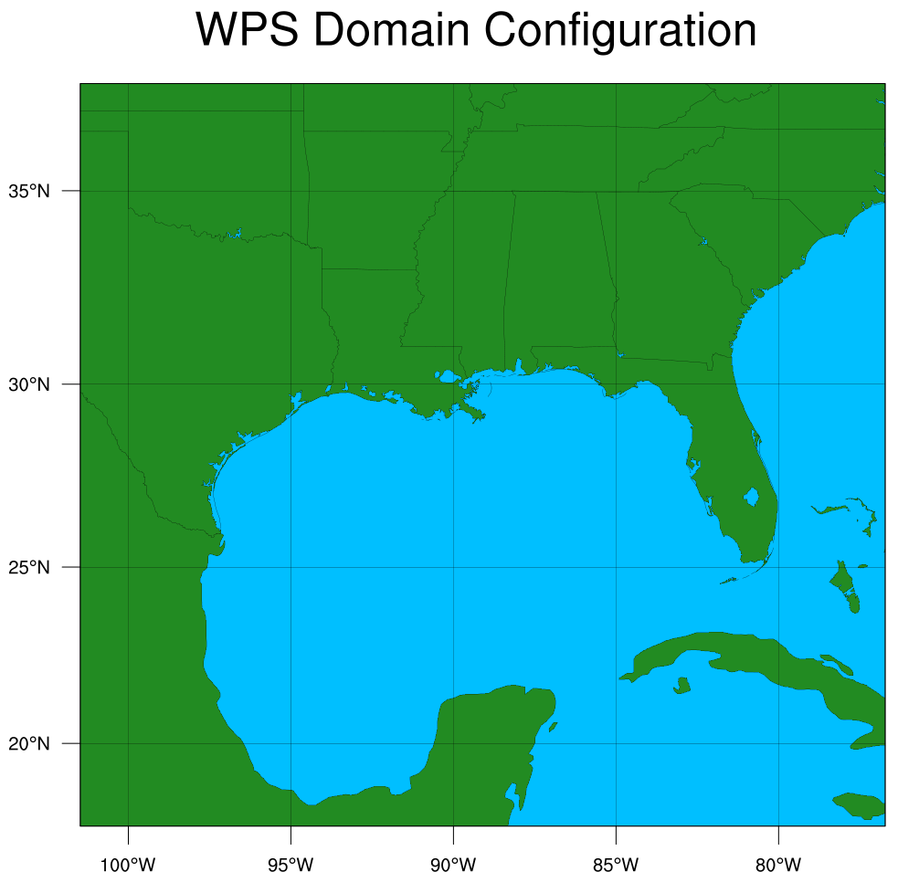

.. _wrf_grid:

1. Generating the Atmospheric input files
==========================================

WRF Preprocessing System
-------------------------

The WRF Preprocessing System prepares the input files necessary for a WRF simulation. A few of the core functionalties of WPS include generating the simulation grid (domain), interpolating time-invariant terrestrial data to the simulation domain, interpolating time-varying meteorological data from other models onto the simulation domain [1]_ [2]_. 

We summarize the essential steps required to generate the initial and boundary conditions for the WRF model run. For a more comprehensive tutorial, please follow along with 

`WRF WPS Online Tutorial <https://www2.mmm.ucar.edu/wrf/OnLineTutorial/compilation_tutorial.php>`_

1. Obtain and build WRF and WRF Preprocessing System (WPS) source
^^^^^^^^^^^^^^^^^^^^^^^^^^^^^^^^^^^^^^^^^^^^^^^^^^^^^^^^^^^^^^^^^

Download a bug-fixed version of the WRF and WPS v3.5.1 code from `this link <https://www2.mmm.ucar.edu/wrf/users/download/get_sources_temp.html>`_

Step 1: Extract the 
^^^^^^^^^^^^^^^^^^^^^^^^^^^^^^^^^^^^^^^^^^^^^^^^^^^^^^^^^^^^^^^^^

#. Download the WRF V3 Static Geographic data from `this link <https://www2.mmm.ucar.edu/wrf/users/download/get_sources_wps_geog_V3.html>`_. Untar the archive and set the **geog_data_path** and **geog_data_res** in namelist.wps to the point to the directory containing the extracted geographic data and the resolution of this dataset respectively. 

#. Specify the boundaries of the atmospheric domain, by setting the following quantities under geogrid in namelist.wps

=====================   ========================================
  field                      Description
=====================   ========================================
  dx dy                 Grid resolution in the x and y directions (in meters)
  e_we e_sn             Velocity grid points in the west-east and south-north directions
  ref_lat ref_lon      Real values specifying the latitude and longitude of a location whose (i,j) location in the simulation is known.
  map_proj              Map projection ('lambert', 'polar', 'mercator', or 'lat-lon.')
  truelat1              First true latitude for the Lambert projection, or the true latitude for the polar and Mercator projections
  truelat2              Second true latitude for the Lambert projection
  stand_lon             A real value specifying the longitude that is parallel with the y-axis in conic and azimuthal projections
 ====================   ========================================

Also see the namelist.wps `best practices guide <https://www2.mmm.ucar.edu/wrf/users/namelist_best_prac_wps.html>`_ for more information.

To view the domain, use  ncl util/plotgrids.ncl

   An overall schematic of the Regional Community Earth System model architecture.

#. Run geogrid.exe

.. code-block:: console

     ./geogrid.exe

When geogrid.exe completes successfully, it generates the files **geo_em.d01.nc** and ****geogrid.log**

#. Decide the initialiation time and the geographical domain, and download the appropriate real-time GRIB data. Some possible options are given in `this page <https://www2.mmm.ucar.edu/wrf/users/download/free_data.html>`_

Note that the `NCAR Research Data Archive <https://rda.ucar.edu>`_ allows registered users to specify the geographical extents, select the time period, and download only the required fields. 

Extract the downloaded grib files and run the script link_grib.sh with the path to this extracted data. 

.. code-block:: console

    cat *.tar | tar xvf - -i
    ./link_grib.csh path_to_data

then create a symbolic link to the Vtable appropriate for the real-time data in use. For GFS, we can do 
.. code-block:: console
    ln -sf ungrib/Variable_Tables/Vtable.GFS Vtable

In namelist.wps, set the **start_date**,**end_date**, **interval_seconds** under share and **prefix** under ungrib (to 'GFS').

#: Request sufficient memory on a compute node and run ungrib.exe

.. code-block:: console

    ./ungrib.exe

This should have generated a file with **prefix** from start date to end date and at intervals specified. 
and check the generated inter

.. code-block:: console

    ncl util/plotfmt_nc.ncl GFS:2016-12-28_18
    util/rd_intermediate GFS:2016-12-28_18

#: Run metgrid.exe

.. code-block:: console

    ./metgrid.exe

#: Generate IC and BC files

.. code-block:: console

    cd ${WRF_ROOT}/test/em_real
    ln -sf ../../../WPS_788/met_em.d01.201* .

Edit **namelist.inp** 

.. code-block:: console

    ./real.exe

modify namelist.inp
https://esrl.noaa.gov/gsd/wrfportal/namelist_input_options.html

Replacing fields in wrfinput

https://wiki.uio.no/mn/geo/geoit/index.php/Replacing_fields_in_wrfinput

-----------------------------------------------------------------------------

Common issues and their fixes
------------------------------

- **Issue #1:**

.. code-block:: console

  ERROR: Could not open file METGRID.TBL

**Fix:** Set the opt_metgrid_tbl_path to './' or as appropriate

- **Issue #1:**

.. code-block:: console

 Domain  1: Current date being processed: 2016-01-01_00:00:00.0000, which is loop #   1 out of 1465
 configflags%julyr, %julday, %gmt:        2016           1   0.00000000
  metgrid input_wrf.F first_date_input = 2016-01-01_00:00:00
  metgrid input_wrf.F first_date_nml = 2016-01-01_00:00:00
 -------------- FATAL CALLED ---------------
 FATAL CALLED FROM FILE:  <stdin>  LINE:     851
  input_wrf.F: SIZE MISMATCH:  namelist ide,jde,num_metgrid_levels= 90  75  32 ; input data ide,jde,num_metgrid_levels=90 75 27
 -------------------------------------------
 -------------- FATAL CALLED ---------------
 FATAL CALLED FROM FILE:  <stdin>  LINE:     851
  input_wrf.F: SIZE MISMATCH:  namelist ide,jde,num_metgrid_levels= 90  75  32 ; input data ide,jde,num_metgrid_levels=90 75 27
 -------------------------------------------
  STOP wrf_abort

**Fix:** num_metgrid_levels in namelist.input

- **Issue #2:**

.. code-block:: console

  -------------- FATAL CALLED ---------------
   FATAL CALLED FROM FILE:  <stdin>  LINE:     851
    input_wrf.F: SIZE MISMATCH:  namelist ide,jde,num_metgrid_levels= 90  75  32; input data ide,jde,num_metgrid_levels=90  75  27
   -------------------------------------------
   -------------- FATAL CALLED ---------------
   FATAL CALLED FROM FILE:  <stdin>  LINE:     851
    input_wrf.F: SIZE MISMATCH:  namelist ide,jde,num_metgrid_levels= 90  75  32; input data ide,jde,num_metgrid_levels=90  75  27
   -------------------------------------------
  Note: The following floating-point exceptions are signalling: IEEE_OVERFLOW_FLAG
  STOP wrf_abort

**Fix:**
Upgrades to GFS on May 11, 2016. Moved from 27 vertical levels to 32.

https://www.perspectaweather.com/blog/2016/5/19/noaa-upgrades-its-primary-computer-forecast-model
https://www.enviroware.com/how-to-deal-with-GFS-upgrades-when-running-WRF/

https://forum.wrfforum.com/viewtopic.php?f=6&t=9761
You can request customizable data and in the "Vertical Level(s):" you can select all fields, except:
- all available ( obviously)
- isobaric surface: 7 mbar
- isobaric surface: 5 mbar
- isobaric surface: 3 mbar
- isobaric surface: 1 mbar

And submit a request.

This way, you will have your entire data base with 27 vertical levels.

- **Issue #3:**

.. code-block:: console

  *************************************
  d01 2014-05-12_00:00:00 *** Initializing nest domain # 2 from an input file. ***
  -------------- FATAL CALLED ---------------
  FATAL CALLED FROM FILE:  <stdin>  LINE:      70
  program wrf: error opening wrfinput_d02 for reading ierr=          -8
  -------------------------------------------

**Fix:** ./wrf.exe called before ./real.exe was called

.. [1] Kelly Keene, The  WRF Preprocessing System, COAWST Tutorial,2016 (`pdf <http://140.112.69.65/research/coawst/COAWST_TUTORIAL/training_15aug2016/presentations/monday/WPS.pdf>`_ )
.. [2] WRF ARW User Guide, Version 3, 2014 (`pdf <https://www2.mmm.ucar.edu/wrf/users/docs/user_guide_V3.5/ARWUsersGuideV3.pdf>`_ )

https://www.climatescience.org.au/sites/default/files/werner_data_utilities.pdf

http://www.mce2.org/11_aug_6_WRF_postprocessing%20%28Bruyere%29.pdf

http://wiki.cima.fcen.uba.ar/mediawiki/index.php/WRF